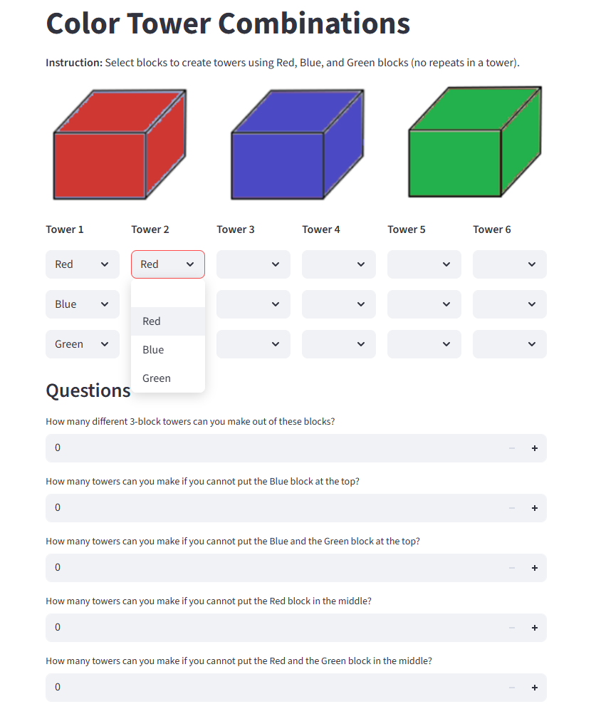

# 🏰 Color Towers - Streamlit App

## About

**Color Towers** is an interactive **Streamlit app** designed for **Mathayom 1–3 students** to practice **combinations** and **permutations**. The app lets students build towers with blocks of three colors—Red, Blue, and Green—while answering questions related to the number of valid combinations under certain rules.



---

### 🎓 About the App

**Color Towers** helps students:

- **Understand combinations and permutations**
- **Practice calculating the number of valid combinations** based on restrictions (e.g., no Blue at the top)
- Reinforce **logical problem-solving** and **basic probability**

---

### 📋 How It Works

1. **Build Towers**: Students select colors for each of the three blocks to create a valid 3-block tower (no repeats).
   
2. **Answer Questions**: After building the towers, students answer questions based on different constraints, such as:
   - How many towers can be made without Blue at the top?
   - How many towers can be made if no Red is in the middle?

3. **Check Answers**: After inputting their answers, students receive feedback to verify if they are correct.

---

### 📝 Getting Started


1. Install required packages:

   ```bash
   pip install streamlit
   ```
   
2. Save the script (`streamlit-app.py`).
3. Place the image (rbg.png) in the same directory.
4. Run the app:

    ```bash
    streamlit run streamlit-app.py
    ```

---

## File Structure
```plaintext
/color-towers
├── streamlit-app.py        # Main Streamlit app script
└── rbg.png                 # Image showing Red, Blue, Green blocks
```

## License

MIT License. Feel free to use and adapt for classrooms or educational purposes.
